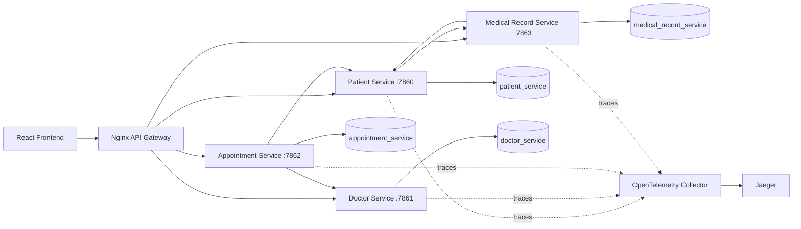

# Healthcare Microservices

> Aplikasi layanan kesehatan berbasis microservices dengan backend Ruby Sinatra, frontend React, PostgreSQL, API Gateway Nginx, dan distributed tracing OpenTelemetry.


---

## Overview

Healthcare Microservices memisahkan domain pasien, dokter, appointment, dan rekam medis ke dalam service independen. Setiap service memiliki database PostgreSQL sendiri, migrasi Sequel, API HTTP, request spec RSpec, serta konfigurasi runtime berbasis environment variable.

Project ini cocok untuk:

| Audiens | Manfaat |
| --- | --- |
| Backend developer | Mempelajari service boundary, REST API, dan komunikasi antar-service |
| DevOps learner | Menjalankan multi-container stack, health check, migrasi, dan deployment |
| QA / reviewer | Memverifikasi API dengan RSpec, Vitest, lint, CI, dan smoke test |
| Observability learner | Mengikuti trace lintas service dengan OpenTelemetry dan Jaeger |

> Project ini ditujukan untuk pembelajaran dan demonstrasi. Sebelum production publik, ganti seluruh kredensial default, aktifkan TLS, batasi CORS, dan gunakan secret manager.

## Table of Contents

- [Architecture](#architecture)
- [Tech Stack](#tech-stack)
- [Implemented Features](#implemented-features)
- [Prerequisites](#prerequisites)
- [Quick Start](#quick-start)
- [Verification](#verification)
- [Runtime URLs](#runtime-urls)
- [Database Migrations](#database-migrations)
- [Deployment](#deployment)
- [Project Structure](#project-structure)
- [Testing](#testing)
- [Troubleshooting](#troubleshooting)
- [Documentation](#documentation)
- [Roadmap](#roadmap)

## Architecture



PostgreSQL dijalankan sebagai satu instance pada Docker Compose, tetapi setiap domain memakai database terpisah. Service tidak melakukan foreign key lintas database; referensi antar-domain divalidasi melalui HTTP.

## Tech Stack

| Layer | Technology |
| --- | --- |
| Frontend | React 18, TypeScript, Vite |
| Backend | Ruby 3.3, Sinatra, Rack |
| Database | PostgreSQL 16, Sequel migrations |
| API Gateway | Nginx |
| Observability | OpenTelemetry Collector, Jaeger |
| Testing | RSpec, Rack::Test, Vitest, React Testing Library |
| Orchestration | Docker Compose |
| CI | GitHub Actions |

## Implemented Features

- CRUD pasien, dokter, ruangan, timeslot, jadwal, appointment, dan rekam medis.
- API Gateway dengan satu origin `/api/...` dan CORS handling.
- Database PostgreSQL terpisah per service.
- Migrasi database otomatis sebelum service menerima traffic.
- Integrasi frontend dengan loading state dan error handling.
- Distributed tracing OpenTelemetry dan visualisasi Jaeger.
- Backend request specs, frontend tests, lint, build, dan smoke tests.
- CI untuk quality checks dan validasi Docker Compose.

## Prerequisites

| Tool | Minimum | Notes |
| --- | --- | --- |
| Docker | 24+ | Cara termudah menjalankan backend dan PostgreSQL |
| Docker Compose | v2 | Umumnya sudah termasuk Docker Desktop |
| Node.js | 18+ | Diperlukan untuk frontend lokal |
| Ruby | 3.3 | Hanya diperlukan untuk mode backend non-Docker |
| RAM | 4 GB free | 8 GB disarankan jika observability diaktifkan |

## Quick Start

1. Clone dan masuk ke repository.

```powershell
git clone https://github.com/iceblessedtea/ilkom22-paralel-5.git
cd ilkom22-paralel-5
```

2. Jalankan PostgreSQL, backend services, dan API Gateway.

```powershell
cd services
docker compose up -d --build
```

3. Jalankan frontend.

```powershell
cd ..\frontend
npm install
npm run dev
```

4. Buka frontend di <http://localhost:5173>.

Migrasi database dijalankan otomatis oleh setiap container backend. Data PostgreSQL disimpan pada named volume `services_postgres-data`.

## Verification

Periksa container:

```powershell
cd services
docker compose ps
```

Periksa API Gateway:

```powershell
curl.exe http://localhost/api/health
curl.exe http://localhost/api/patients
curl.exe http://localhost/api/doctors
```

Periksa database:

```powershell
docker compose exec postgres psql -U healthcare -d patient_service -c "\dt"
```

Jalankan smoke test end-to-end:

```powershell
.\scripts\smoke-docker.ps1
```

## Runtime URLs

| Component | URL |
| --- | --- |
| Frontend | <http://localhost:5173> |
| API Gateway | <http://localhost> |
| Gateway health | <http://localhost/api/health> |
| Patient Service | <http://localhost:7860> |
| Doctor Service | <http://localhost:7861> |
| Appointment Service | <http://localhost:7862> |
| Medical Record Service | <http://localhost:7863> |
| Jaeger UI | <http://localhost:16686> |

## Database Migrations

Setiap service menyimpan migrasi di `db/migrations` dan memiliki runner `db/migrate.rb`.

Menjalankan migrasi manual di Docker:

```powershell
cd services
docker compose run --rm patient-service bundle exec ruby db/migrate.rb
docker compose run --rm doctor-service bundle exec ruby db/migrate.rb
docker compose run --rm appointment-service bundle exec ruby db/migrate.rb
docker compose run --rm medical-record-service bundle exec ruby db/migrate.rb
```

Untuk membuat perubahan skema, tambahkan file migrasi bernomor berikutnya pada service pemilik data. Jangan mengubah migrasi yang sudah pernah diterapkan pada environment bersama.

## Deployment

Deployment single-host dapat memakai Docker Compose:

```powershell
cd services
docker compose pull
docker compose up -d --build
docker compose ps
```

Checklist sebelum production:

- Ganti user dan password PostgreSQL default.
- Simpan secret di environment platform atau secret manager.
- Jangan mengekspos port PostgreSQL `5432` ke internet.
- Tempatkan API Gateway di belakang TLS reverse proxy atau load balancer.
- Batasi `Access-Control-Allow-Origin` pada domain frontend.
- Aktifkan backup terjadwal dan uji restore secara berkala.
- Aktifkan OpenTelemetry dan monitoring container.

Panduan deployment lengkap, rollback, dan health verification tersedia di [Deployment Guide](docs/DEPLOYMENT.md).

Backup manual:

```powershell
services\scripts\backup-databases.ps1
```

Panduan restore tersedia di [PostgreSQL Backup and Restore](docs/DATABASE_BACKUP.md).

## Project Structure

```text
ilkom22-paralel-5/
|-- frontend/                    # React + TypeScript + Vite
|-- services/
|   |-- patient-service/         # Domain pasien
|   |-- doctor-service/          # Dokter, ruangan, timeslot, jadwal
|   |-- appointment-service/     # Janji temu
|   |-- medical-record-service/  # Rekam medis
|   |-- api-gateway/             # Nginx reverse proxy
|   |-- postgres/init/           # Inisialisasi database PostgreSQL
|   |-- scripts/                 # Start, test, lint, dan smoke helpers
|   `-- docker-compose.yml
|-- observability/               # OpenTelemetry Collector dan Jaeger
|-- docs/                        # Dokumentasi teknis
`-- legacy/                      # Prototype dan implementasi lama
```

## Testing

Backend:

```powershell
services\scripts\run-rspec.ps1
services\scripts\lint-ruby.ps1
```

Frontend:

```powershell
cd frontend
npm test
npm run lint
npm run build
```

Docker smoke test:

```powershell
services\scripts\smoke-docker.ps1
```

## Troubleshooting

| Symptom | Resolution |
| --- | --- |
| PostgreSQL belum healthy | Jalankan `docker compose logs postgres` dan cek port `5432` |
| Service gagal saat migrasi | Cek `DATABASE_URL`, status PostgreSQL, dan log service terkait |
| Port sudah dipakai | Hentikan proses lain atau ubah port mapping Compose |
| Frontend gagal fetch | Pastikan API Gateway aktif dan `VITE_API_BASE_URL=http://localhost` |
| Trace tidak muncul | Jalankan overlay observability dan set `OTEL_ENABLED=true` |

Reset container tanpa menghapus data:

```powershell
cd services
docker compose down
```

Reset penuh termasuk database:

```powershell
docker compose down -v
```

> Perintah `down -v` menghapus seluruh data PostgreSQL pada volume project.

## Documentation

1. [Project Overview](docs/PROJECT_OVERVIEW.md)
2. [Architecture](docs/ARCHITECTURE.md)
3. [Environment](docs/ENVIRONMENT.md)
4. [Running Guide](docs/RUNNING_GUIDE.md)
5. [Deployment Guide](docs/DEPLOYMENT.md)
6. [PostgreSQL Backup and Restore](docs/DATABASE_BACKUP.md)
7. [API Reference](docs/API_REFERENCE.md)
8. [Observability](docs/OBSERVABILITY.md)
9. [Testing and Quality](docs/TESTING.md)
10. [Roadmap](docs/ROADMAP.md)

## Roadmap

Phase 1 sampai Phase 6 telah selesai: migrasi terstruktur, PostgreSQL, deployment guide, serta backup dan restore database sudah tersedia. Status rinci ada di [Roadmap](docs/ROADMAP.md).

---

Project ini dibuat sebagai bahan pembelajaran arsitektur layanan kesehatan berbasis microservices.
