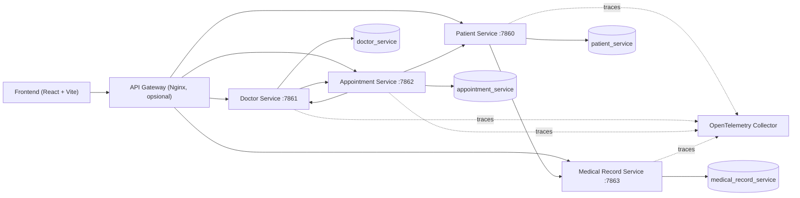

# Architecture

Project ini menggunakan pendekatan _service per domain_. Setiap service memiliki tanggung jawab, port, dan database sendiri, serta berkomunikasi via HTTP.



> Catatan: saat berjalan **tanpa Docker**, frontend dapat mengakses tiap service secara langsung tanpa melewati API Gateway. Saat memakai **Docker**, akses disarankan melalui Gateway.

## Service Boundary

### Patient Service (`:7860`)

Mengelola data pasien dan dapat mengambil data rekam medis dari Medical Record Service.

### Doctor Service (`:7861`)

Mengelola dokter, ruangan, timeslot, dan jadwal. Service ini juga mengecek appointment sebelum menghapus dokter.

### Appointment Service (`:7862`)

Mengelola janji temu. Service ini mengambil data pasien dan dokter untuk membuat response yang lebih lengkap (agregasi).

### Medical Record Service (`:7863`)

Mengelola data rekam medis dan melakukan validasi ke Patient Service.

### API Gateway (`:80`)

Reverse proxy berbasis Nginx, bersifat opsional. Gateway terutama berguna saat menjalankan project dengan Docker, untuk menyatukan akses ke semua service di satu origin (memudahkan konfigurasi CORS dan base URL frontend).

## Komunikasi Antar-Service

| Pemanggil      | Tujuan         | Kegunaan                                           |
| -------------- | -------------- | -------------------------------------------------- |
| Appointment    | Patient        | Mengambil detail pasien untuk response appointment |
| Appointment    | Doctor         | Mengambil detail dokter untuk response appointment |
| Patient        | Medical Record | Mengambil riwayat rekam medis pasien               |
| Doctor         | Appointment    | Mengecek appointment sebelum menghapus dokter      |
| Medical Record | Patient        | Validasi keberadaan pasien                         |

## Konfigurasi URL Antar-Service

URL antar-service **tidak boleh hardcoded** dengan nama container Docker. Gunakan environment variable agar mode Docker dan non-Docker sama-sama valid.

Contoh penggunaan di Ruby:

```ruby
PATIENT_URL        = ENV.fetch("PATIENT_URL", "http://localhost:7860")
DOCTOR_URL         = ENV.fetch("DOCTOR_URL", "http://localhost:7861")
APPOINTMENT_URL    = ENV.fetch("APPOINTMENT_URL", "http://localhost:7862")
MEDICAL_RECORD_URL = ENV.fetch("MEDICAL_RECORD_URL", "http://localhost:7863")
```

Nilai untuk mode Docker (memakai nama service di jaringan compose):

```text
PATIENT_URL=http://patient-service:7860
DOCTOR_URL=http://doctor-service:7861
APPOINTMENT_URL=http://appointment-service:7862
MEDICAL_RECORD_URL=http://medical-record-service:7863
```

Daftar lengkap environment variable ada di [Environment](ENVIRONMENT.md).

## Catatan Arsitektur Saat Ini

- PostgreSQL berjalan sebagai satu instance pada Docker Compose dengan database terpisah per domain.
- Migrasi Sequel dijalankan otomatis sebelum masing-masing service mulai menerima traffic.
- URL antar-service dan koneksi database dikonfigurasi melalui environment variable.
- Belum ada mekanisme retry/timeout standar pada pemanggilan HTTP antar-service; ini direkomendasikan untuk ketahanan (resilience).
- Tracing OpenTelemetry tersedia agar alur antar-service dapat diamati secara end-to-end.
